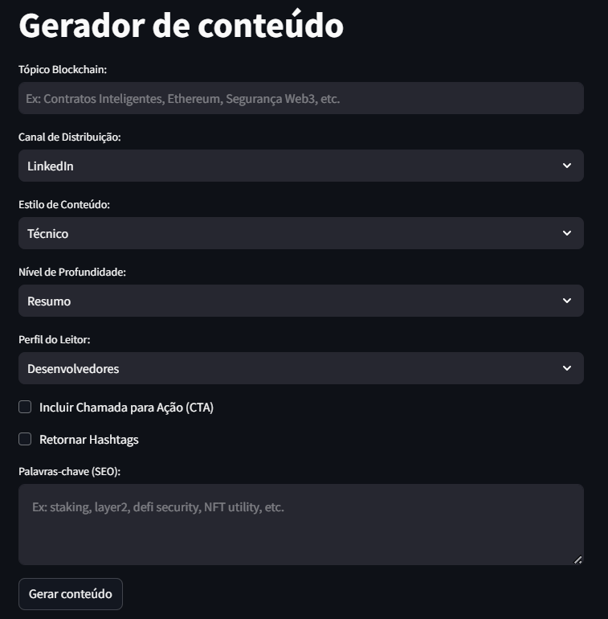

# 🚀 Gerador de Conteúdo Blockchain com IA

Este projeto utiliza a LLM **LLaMA 3 - 70B** via **LangChain + Groq** para gerar conteúdo estratégico voltado ao ecossistema blockchain, como:

- Publicações técnicas para LinkedIn, Medium e blogs;
- Explicações de conceitos Web3;
- Promoções de produtos como tokens, DApps e contratos inteligentes;
- Geração de conteúdo com SEO e CTA.

## 🧠 Tecnologias

- Python
- [Streamlit](https://streamlit.io)
- LangChain
- [Groq API](https://console.groq.com/)
- dotenv

## 📦 Instalação

1. Clone o repositório:
```bash
   git clone https://github.com/seuusuario/gerador-conteudo-blockchain.git
   cd gerador-conteudo-blockchain
```

2. Crie o arquivo .env na raiz do projeto com sua chave da API Groq
```bash
  GROQ_API_KEY="SUA CHAVE DO GROQ AQUI"
```
3. Execute o Aplicativo
```bash
   streamlit run app.py
```

## 📌 Exemplo de Uso
**Selecione**:
- Tópico: Smart Contracts na Ethereum
- Canal de distribuição: LinkedIn
- Tom: Técnico
- Profundidade: Explicativo
- Público-alvo: Desenvolvedores
- Keywords: solidity, ethereum, contratos inteligentes

**Clique em "Gerar Conteúdo" e pronto!**

## 🧑‍🏫 Imagem do Aplicativo

